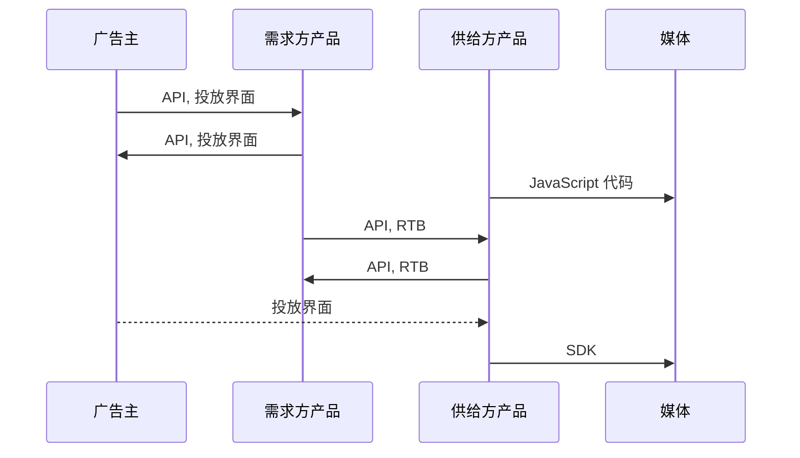
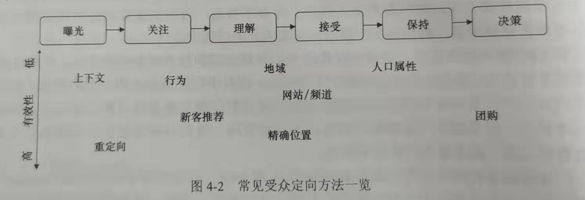
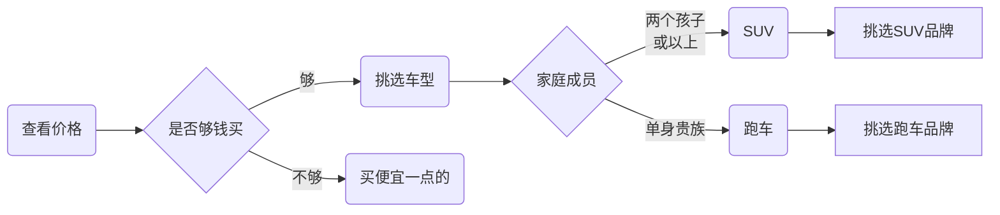
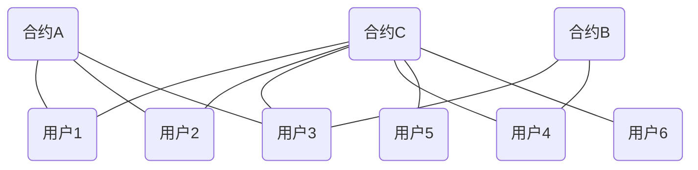
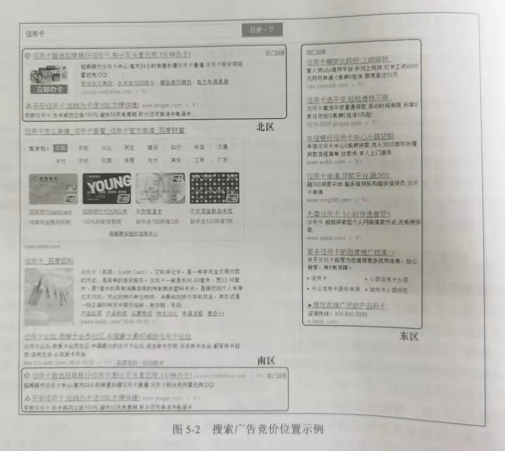
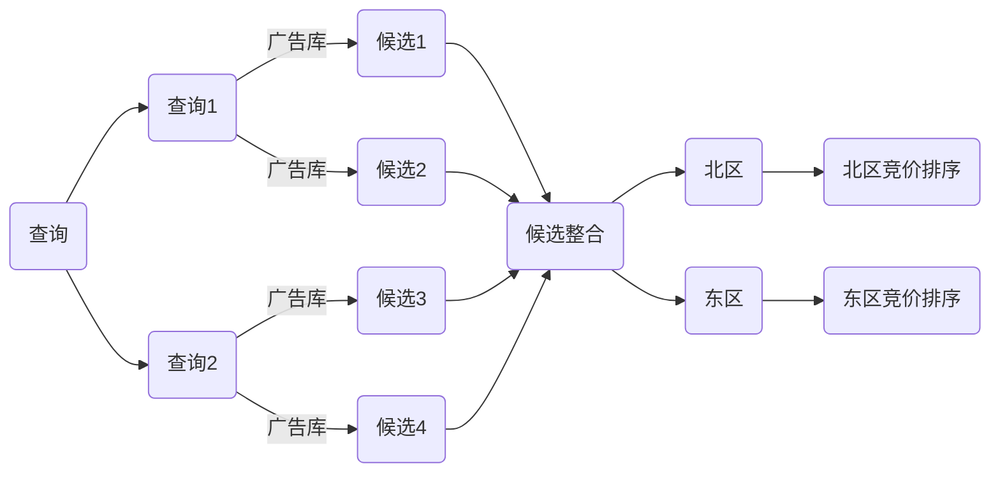
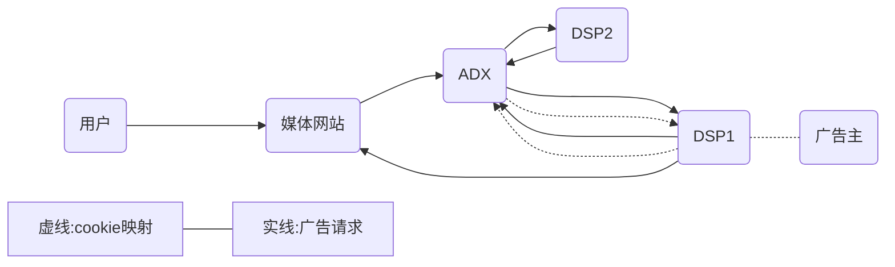
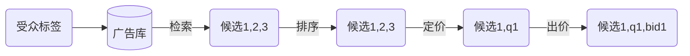
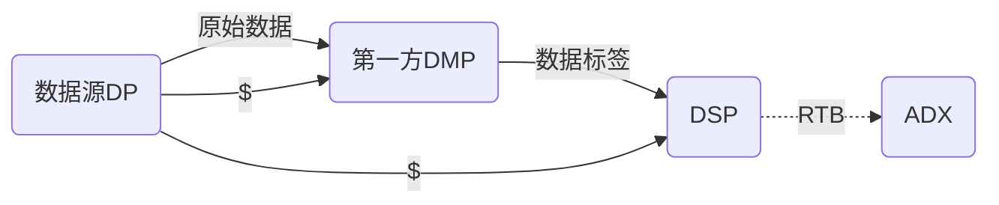
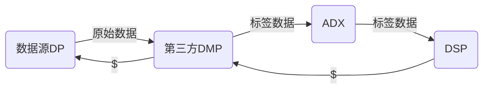

</br>
</br>
</br>
</br>

<p style="text-align: center; ">
    <span style="font-size: 56px; color: rgb(229, 51, 51);">计算广告
    </span>
    <br>
    <span style="color:#00D5FF; font-size: 32px">—互联网商业变现与技术
    </span>
</p>


</br>


<p style="text-align: center;">
    <span style="color:gray; font-size: 20px">邓子谦
    </span>
</p>
</br>

<p style="text-align: center;">
    <span style="color:gray; font-size: 20px">2021.12
    </span>
</p>
<p style="page-break-after:always;">
</p>

## 第2章 计算广告基础

eCPM（千次期望收入）是计算广告中最为核心的量化指标之一。通常可以拆解成点击率和点击价值的乘积。
$$
eCPM = v \times \mu \\
eCPM = 价值 \times 点击率
$$

### 2.1 广告有效性原理

三段式信息传播模型：

```json
｛
	"选择"：｛
		"曝光 -> 关注"
	｝,
	"解释":{
        "理解 -> 接受"
    },
	"态度":{
        "保持 -> 决策"
    }
｝
```

（1）曝光阶段：曝光的有效性对最终结果的影响往往远远高于其他技术因素，且没有太多通过技术优化的空间，所以有“位置为王”的说法。
（2）关注：强曝光不等于用户的时机有效关注。小技巧：1. 尽量不要打断用户的任务；2. 明确传达推送此广告的原因；3. 内容符合用户的兴趣或需求。
（3）理解阶段：不能直观理解内容，就谈不上后续的转化。小技巧：1. 保证内容在用户能理解的具体兴趣范围内；2. 匹配理解门槛、关注程度、设定。
（4）接受阶段：受众理解广告并不代表他认可这些信息。让合适的广告出现在合适的媒体上，即广告安全。
（5）保持阶段：保持用户对广告信息的鲜明记忆。
（6）决策决断：好的广告能够为转化率的提高做好铺垫。

### 2.2 互联网广告的技术特点

（1）技术和计算导向：数字媒体的特点使在线广告可以进行精细的受众定向，技术又使得广告决策和交易朝着计算驱动的方向发展。

（2）效果的可衡量性：他可以以展示和点击的形式直接记录和优化广告效果。

（3）创意和投放方式的标准化：广告主根据一些既定的标准来创作自己的创意，可以充分利用整个市场的流动性，更快地创造价值。

（4）媒体概念的多样化：媒体的多样性导致广告主更需要从营销的角度去审视广告投放，需要匹配广告内容与媒体性质。

（5）数据驱动的投放策略：互联网化的根本驱动力可以认为是对数据的深入加工和利用能力。

### 2.3 计算广告的核心问题

> "Find the best match between a given user in a given context and a suitable advertisement." -- Andrei Broder

​		计算广告的核心问题，是为一些列用户与上下文的组合找到最合适的广告投放策略以优化整体广告活动的利润。

​		收入和投入取决于3个变量：广告本身，用户和上下文。

​		这里的一个隐含假设是，整体的收入或成本可以被分解到每次展示上，但这假设不一定成立。在实际系统中，可以采用频次控制、点击反馈等方式来解决多次展示之间效果相关性的问题。

#### 2.3.1 广告收入的分解

​		再一次广告展示后，有可能发生哪些后续行为？当用户看到广告后，如果产生兴趣，那么首先产生的就是“点击行为”，广告点击与广告展示的比率为"点击率"（Click Through Rate，CTR）；点击成功后，将会打开广告主的落地页（landing page），落地页成功打开次数与点击次数的比率为"到达率"；如果用户从落地页开始，进一步完成下单等操作，则成为转化，转化次数与到达次数的比率为“转化率”(Conversion Rate, CVR)。

​		依据上位行为对收入r进行分解：
$$
eCPM = r(a, u, c) = \mu(a, u, c) ·v(a, u, c)
$$
​		其中，$$\mu$$为点击率，$v$为单次点击价值。前者描述的是发生在媒体上的行为，后者描述的是广告主站内的行为，两部分的乘积定量地表示了某次展示的eCPM。在对多个候选排序时，是根据eCPM还是CTR排序也是区别广告产品和用户产品的重要策略特征。

​		eCPM一般指的是估计的千次展示收益，RPM一般指的是千次展示收入，CPM一般指的是千次展示成本。

#### 2.3.2 结算方式与eCPM估计的关系

​		虽然大部分eCPM需要给定$(a,u,c)$元组来进行计算，但并非每个广告产品都可以对eCPM进行分解。因此在市场上存在以下几种广告计费模式。

（1）CPT(COST PER TIME)：将某个广告位按独占方式交给某广告主，并按独占的时间段收取费用的方式。

（2）CPM(COST PER MILLE)：按照千次展示结算，这种方式需要由需求方（广告主）来估计和控制其中的风险。实际上，大多数互联网品牌广告，CPM都是主流的结算方式。

（3）CPC(COST PER CLICK)：点击结算。点击率的估计是由供给方（或中间市场）完成的。以CPC方式结算，在效果类广告市场中具有接近垄断的地位。

（4）CPS(COST PER SALE) / CPA(COST PER ACTION) / ROI：按照销售订单、转化行为或投入产出比来结算，这些都是按照转化付费的一些变种。

（5）oCPM(optimized CPM): oCPM是Facebook主推的一种新结算方式，意思是广告平台仍然按照CPM结算费用，但会根据转化率进行优化。

|  结算方式   | 点击率估计 | 点击价值关机 | 优缺点                                                   | 使用场景                                   |
| :---------: | :--------: | :----------: | -------------------------------------------------------- | ------------------------------------------ |
|     CPT     |   需求方   |    需求方    | 可以充分发挥橱窗效应，但无法利用受众定向技术             | 高曝光的品牌广告                           |
|     CPM     |   需求方   |    需求方    | 可利用受众定向选择目标人群，但合约收买下受众划分不能过细 | 有受众选择需求的品牌广告，实时竞价广告交易 |
|     CPC     |   供给方   |    需求方    | 可以惊喜划分受众人群，合理的供给方和需求方分工           | 竞价广告网络                               |
| CPS/CPA/ROI |   供给方   |    供给方    | 需求方无任何风险，但供给方运营难度过大                   | 效果类广告联盟，效果类DSP                  |
|    oCPM     |   供给方   |    供给方    | 向CPA方式的稳健过度                                      | 数据能力较强的广告平台                     |

### 2.4 在线广告相关行业协会

交互广告局（IAB）

美国广告代理协会（4A）

美国国家广告商协会（ANA）


## 第3章 在线广告产品概览

​		在线广告产品形式丰富，其发展历程可以分为4个阶段：

（1）合约广告产品：由线下广告的交易形式衍生而来，可以分为按照时段售卖的CPT广告和按照约定展示量售卖的CPM广告。

（2）竞价广告产品：其最重要的形式是搜索广告，形式为对搜索关键词的竞价。竞价广告产生的根本原因是为了变现注入关键词、精细用户标签等高价值但量不懂的数据，从合约中放弃量的保证以后的结果。

（3）程序化交易广告产品：竞价广告进一步发展，催生了实时竞价的交易形式。这使得需求方可以更灵活地划分和选择自己的目标受众。以实时竞价为核心的一系列交易方式组件演变为机器之间以程序化的方式完成广告交易决策，其主要推动力市场中广告主数据和第三方数据的使用与变现，也催生了数据交易市场。

（4）原生广告产品：原生广告更注重场景数据的加工和使用，这也代表了移动时代的新问题和新思路。

​		每个广告产品基本都有3个组成部分，面向需求方的接口，面向供给方的接口以及中间的投放系统及匹配策略。

### 3.1 商业产品的设计原则

（1）相对于产品功能，要特别关注产品中的策略部分。

（2）要特别关注数据，让运营和产品优化形成闭环。从数据分析开始，以数据结束，这样的闭环式迭代是最适合商业产品的开发模式。

（3）追求便捷性的设计原则依然非常重要。

### 3.2 广告系统的产品接口

####  3.2.1广告主层级组织与投放管理

​		广告的层次一般分为广告主，广告计划（campaign），广告组（ad group），广告创意。

（1）广告计划概念上对应于广告主的一次投放合同，其中包括预算、时间范围等基本信息。

（2）广告组对应于一个具体的广告投放策略，主要是设定受众定向条件和出价。广告组最重要的功能是设置各种各样的定向条件，是广告效果优化的关键层级。

（3）广告创意则是最终展示出来的素材。

#### 3.2.2 供给方管理接口

#### 3.2.3 供需之间的多种接口形式



媒体<——>供给方：

（1）对于Web/WAP类网页媒体，可以在媒体页面中嵌入JavaScript代码，想供给方服务器发起请求并完成渲染。

（2）对于原生代码实现的iOS/Android应用，需要在应用中集成供给方的SDK，其功能与网页上的JavaScript代码基本一致。

（3）有的媒体会采用API的方式对接。简单来说，就是媒体的服务器向供给方服务器请求广告，然后自行完成决策和渲染。分离线和在线两种模式：离线模式下，供给方预先请求并缓存广告，在没测广告展示时自行排序和决策；在线模式下，供给方每次广告展示都会请求广告。

供给方、需求方<——>广告主：

（1）最常见的投放方式是广告主通过一个用户界面用人工的方式管理投放和优化效果。

（2）当广告主的投放很复杂或者需要自动调整优化时，广告平台会提供与界面功能相对应的API接口。

（3）某些特殊的广告投放需要自动对接广告主的商品和用户行为。这时就需要在广告主页面嵌入JavaScript代码，根据收集到的信息进行广告决策。

供给方<——>需求方：

（1）API对接。

（2）程序化交易的RTB或其他类似的港式。（1）（2）的区别在于，RTB除了返回广告信息外，还会给出报价。


## 第4章 合约广告

​		在线广告业务的初期，媒体和广告主的代理商是市场的主要参与者。线下广告的商业逻辑也被照搬到线上了，有代理公司和媒体签订协议，确保某些广告位在某时间段为指定广告商所占有。这种CPT结算的广告位合约方式对技术的依赖性比较小。

​		合约广告的重要形式是按CPM计费的展示量合约。这种方式依然用合同约定确定一次广告活动的投放总量和展示单价。其售卖方式是“广告位+人群”，是在线广告发展的一个里程碑。而且CPM售卖直接催生了受众定向技术。

### 4.1 广告位合约

​		广告位合约是最早产鹏的在线广告售卖方式，相应的结算方式是CPT。在一些特定的场景下是有可取之处的，例如在一些强曝光属性的广告位上，采用这种度展示的广告投放，往往可以有效地给用户带来品牌冲击。这种合约模式还可以附加一部分额外服务，例如在一个页面上的竞品排他。在受到受众定向技术的影响，广告位合约的执行方式也有所改变。即使某个广告位都放同一个广告主的创意，但不意味着要投放同样的创意，根据受众来选择播放的创意，也是一个很重要的作用。

​		此外，还可以采用轮播售卖的形式，将同一个广告位依次标上轮播顺序，多个广告创意轮番使用同一个广告位。但需要注意的是，第一次展示的顺序号不应该设为1，而是应该按相等概率从所有轮播顺序中随机挑选一个，已达到流量分配一致。

### 4.2 受众定向

​		大多数广告产品的核心是按照受众售卖的。因此，受众定向是非常重要的支撑技术。在考察某种定向方法时，有两个关键点需要注意：1. 定向的效果，即符合该定向方式的流量高处平均效果的水平；2. 定向的规模，即这部分流量占整体广告库存流量的比例。效果好、覆盖率高的定向方法是我们追求的目标，不过往往难以两全。因此，广告系统往往需要同时提供多种定向方法的支持，以达到整体流量上质的最优化。

#### 4.2.1 受众定向方法概览



​		水平方向表示的是定向技术在广告信息接收过程中大致起作用的阶段，而垂直方向为定性的效果评价。

（1）<font color=red>地域定向</font>：由于很多广告主的业务有区域特性，因此低于定向是所有在线广告系统都必须支持的定向方式。虽然地域定向一般来说效果有限，确实一种不可或缺的流量选择手段。

（2）<font color=red>人口属性定向</font>：人口属性定向虽然在效果上未必突出，但是由于在传统广告的话语体系中，大量使用这类标签来表达受众，因此它特别为品牌广告主所熟悉。人口属性的主要标签包括年龄、性别、受教育程度、收入水平等。如果是预测人口属性，那么其必要性不大，因为其实根据其他行为特征得到的，并不能提供额外的信息量。

（3）<font color=red>上下文定向</font>：根据网页或应用的具体内容来匹配相关的广告。上下文定向的颗粒度可以是管检测、主题，也可以是根据广告主需求确定的分类。这种方式一个非常大的好处就是覆盖率比较高，对于大多数广告展示，不论对当前访问用户的信息了解多少，都可以根据当前浏览的页面推测用户的即时兴趣，从而推送相关的功劳。是ADN中首选的定向方法之一。

（4）<font color=red>行为定向</font>：其框架是根据用户的示例访问行为了解用户兴趣，从而投送相关广告的。他提供了一种一般性的思路，使我们可以变现在互联网上收集到的用户行为数据。因此，行为定向的框架、算法和评价指标奠定了在线广告数据驱动的本质特征，并催生了相关的数据加工和交易的衍生业务。

（5）<font color=red>精确位置定向</font>：在移动设备上投放广告时，可以获取肥成精确的地理位置，这使得基于精确地理位置的广告投放成为可能。使得大量区域性非常强的小广告主（如餐饮、美容等）有机会投放精准定位的广告。与传统意义上的地域定向存在质的变化了，成为移动广告最重要的机会之一。

（6）<font color=red>重定向</font>：这是一个最简单的定制化标签，其原理是对某个广告主过去一段时间内的访客投放广告以提升效果。重定向在各种定向方式中被认为精准程度最高，效果最突出的，不过覆盖人群往往比较小。

（7）<font color=red>新客推荐定向</font>：其思路是根据广告主提供的种子房客信息，结合广告平台更丰富的数据，为广告主找到行为上相似的潜在客户。

（8）<font color=red>动态定价</font>：

（9）<font color=red>场景定向</font>：基于移动设备所处的背景状态来调整广告推送内容。

#### 4.2.2 受众定向标签体系

​		在受众定向中，需要将每个用户都映射到一个或几个标签当中，如何规划合理的标签体系对广告产品的运营影响非常大。一般标签体系有两种组织方式，一种是按照某个分类法，制定一个层次标签体系，其中上层标签是下一层的父节点，在人群覆盖上是包含关系。这一体系中，标签是根据需求方的逻辑而制定的。另一种兴趣标签的组织方式，是根据广告主的具体需求设置相应的标签，所有的标签并不能在同一个分类体系中描述，也不存在明确的父子关系。这种标签往往包含一些比较精准的标签的集合，因而主要适用于多种目标，特别是效果目标并存的广告主的精准流量选择要求。

#### 4.2.3 标签体系的设计思路

​		受众定向产品上最关键的环节就是如何描述用户，也就是如何设计标签体系，这甚至比受众定向技术更重要。其中的关键思路是<font color=#ff0, size=5>深入研究行业的用户决策过程</font>。

（1）汽车行业：客户的决策逻辑是比较清晰的。



### 4.3 展示量合约

​		如今，互联网主流的品牌广告投放方式是按照CPM结算的展示量合约。展示量合约指的是约定某种受众条件下的展示量，并按照事先约定好的单位展示量价格来结算。也称担保式投放，即GD。

​		接下来从供给方和需求方两方面来论述一下，这种售卖方式出现的合理性。媒体从固定广告位售卖变为CPM售卖的初衷是为了在流量变现的基础上加入数据变现，面向的仍然是原来的广告主。广告主按广告位才买时，比较容易预估自己拿到的流量，可是按照人群定向的方式采买，流量却有着很多不确定的因素。因此，需求方希望在合约中加入对量的保证，才能放心地采买。

​		但是，CPM虽然以人群为显示标的进行售卖，但是需要注意一个非常重要的事实：展示量合约并没有摆脱广告位。这是因为在CPM这种结算模式下，无法将多个差别很大的广告位打包成统一售卖标价。因为不同广告位的曝光有效性可能差别巨大。实际上，CPM合约往往是以一些曝光量很大的广告位为基础，再切分人群售卖，罪定性的例子是视频网站的贴片位置或者门户网站首页的广告位。

​		虽然CPM合约仍然是比较传统的交易模式，但是从技术层面上看，这种模式的出现实际上已经反映了互联网广告计算驱动的本质：分析得到用户和上下文的属性，并由服务端根据这些属性及广告库情况动态觉得广告候选。其中需要一系列技术手段的支持，主要包括手中定向、流量预测和担保是投放等。

#### 4.3.1 流量预测

​		流量预测在广告产品有3个主要用途。

（1）售前指导。因为要约定曝光总数，所以事先尽可能准确地预测各人群标签的流量至关重要。如果流量严重被低估，就会出现资源售卖量不足的情形；如果被严重高估，泽会出现合约不能达成的状况。

（2）在线流量分配。由于合约之间在人群选择上会有很多交集，当一次曝光同时满足两个以上合约的要求时，怎样分配给哪个合约才能满足所有合约的目的，这就是在线分配问题。各种在线分配算法都要依赖于流量预估的结果。

（3）出价指导。由于没有了量的保证，广告主旺旺需要根据自己的预计出价先了解一下可能获得多少流量，以判断自己的出价是否合理。

​		总的来说，广告里一般的流量预测问题，可以描述成对流量$t(u,b)$这个函数的估计。$u$是给定人群标签或人群标签的组合，$b$是出价。在展示量合约中，因为没有竞价，所以可以看成$b \rightarrow \infin$。

#### 4.3.2 流量塑形

​		在有些情形下，我们可以主动地影响流量，以利于合约的达成。例如，门户网站的各子频道的流量严重依赖于首页关键位置链接的导流，例如在车展期间，汽车频道上的展示广告需求旺盛，那么首页上的链接应该更多地给汽车频道导流以利于收入的增加。

#### 4.3.3 在线分配

​		CPM合约会面临各个合约要求的人群很可能大量交叠的问题，那么如何设计分配策略，使得各个合约都尽可能被满足呢？（如下图所示）



​		在实际情况种，我们需要在每一次曝光时实时做出分配决策，因此这一策略问题成为在线分配。

#### 4.3.4 产品实例

Yahoo！ GD市场

一个广告产品声称自己的标签体系多么复杂，有多少标签种类，这些实际上没有太大的意义，而这些标签的人群规模才更有说服力。


## 第5章 搜索广告和竞价广告

​		在搜索广告和展示广告中都产生了竞价交易模式。对比合约广告，竞价交易模式持的本质是将量的约束从交易过程中去除，仅仅采用“价高者得”的简单决策方案来投放广告。搜索广告在竞价广告乃至整个在线广告中都居于旗舰产品的地位。除了他的变现能力和市场规模方面的优势，更重要的是，一些在计算广告中非常核心的产品策略和技术方案都来源于搜索广告。对搜索广告的深入理解，对于理清整个竞价广告市场非常关键。如何设计合理的市场规则和定价策略，使竞价市场的竞争更加合理充分，对于整体收益有相当大的影响。

​		广告网络中竞价的标的有两种：一是上下文页面中的关键词，这是直接从搜索广告衍生而来的；二是根据用户行为加工的兴趣标签，这是从展示广告的定向逻辑发展而来的。由于广告位、上下文和用户标签的用小型差别巨大，所以除了安全按照eCPM估计排序广告外，冷启动问题以及各种复杂环境下点击率的归一化非常重要。

​		面对竞价广告的产生，需求方的产品和技术也在发生变化。其中关键的变化有两点：意识由面向广告位才买变成面向人群的跨网络采买；二是帮助广告主在竞价环境下完成凉的保证，而这在竞价市场本事不在保证。

### 5.1 搜索广告

​		搜索广告占整个在线广告市场的一半以上，在中国市场中，包含搜索引擎广告和垂直搜索引擎广告（如淘宝直通车）。

搜索广告是典型的的竞价广告产品，其特点是广告主就标的物（这里是关键词）的广告展示机会展开拍卖式的竞争，并根据竞争结果一次占据该广告展示的若干位置。广告主需要自行调整效果和量的平衡；价格的约定也被去掉，每个广告主都可以随时调整某个关键词上的出价。

#### 5.1.1 搜索广告的产品形态

​		所搜广告是以查询词为颗粒度进行手中定向，并按照竞价方式售卖，按CPC结算的广告产品。

百度搜索例子：



​		PC搜索栏广告创意的展示区域一般分为北、东、南三个区域。北区和东区的所有位置构成同义词关键词拍卖的位置集合，竞价时位置的排序为$\{north_1,north_2,...,south_1,south_2,...\}$，这基本是根据各个位置点击率的高低排序的，同时，并不需要在这些位置上全出广告。对于南区的广告，不同的搜索引擎有不同的产品处理方法，有的直接复制北区，有的复制东区。搜索广告最基本的形式是与自然检索结果一直的文字链。一般会加上一些特征区别于自然结果。从而减低误触率，减低广告主的无效消费和提升用户体验。

​		移动搜索结果一般简单组织成信息流的形式，所以移动搜索广告的形式比PC搜索广告要简单。

搜索广告的特点：

（1）搜索广告的变现能力（eCPM）远远高于一般的展示广告。

（2）搜索广告的受重点向标签，级是上下文的搜索查询，非常强地表征着用户的意图，可以进行非常精准的定向。

（3）搜索广告的展示形式与自然结果的展示形式非常接近。

（4）从搜索栏广告发展起来的竞价交易模式，已经逐渐发展成为互联网广告最主流的交易模式。

#### 5.1.2 搜索广告产品新形式

​		三个探索趋势：

（1）丰富文字链创意的展示形式。

（2）利用东区对相关性要求较低的特点，设计一些拓展广告产品，

（3）优化广告与自然结果的关系，在保证相关性和广告效果的前提下提高收入。

#### 5.1.3 搜索广告产品策略

​		搜索广告决策的基本过程可以分为查询扩展、检索、排序、纺织、定价等5个阶段。查寻拓展是搜索广告特有的策略，目的是为广告主自动拓展相关的查询词，扩大匹配流量。在所搜广告中，排序的依据是eCPM，可以简单地表示成$r(a,c)=\mu(a,c) \cdot bid_{CPC}(a)$。



（1）查询拓展：搜索引擎提供将广告的关键词自动匹配到更多相关查询的服务，可以分为精确匹配、短语匹配、广泛匹配和否定匹配。：

（2）广告放置：当广告候选完成排序以后，需要分别确定北区和东区的广告条数和位置。


### 5.2 位置拍卖与机制设计

​		搜索广告位代表的竞价广告实际上是用拍卖的方式销售广告展示机会的，系统根据广告主的出价以及由此计算出的eCPM，决定谁可以得到某次展示的广告位。$eCPM: r_{as} = \mu_sv_a$。

#### 5.2.1 市场保留价

​		为了控制广告的质量和保持一定的出售单价，竞价广告市场往往要设置一个赢得拍卖位置的最低价格，成为市场保留价（Market Reserve Price, MRP）。一般来说，当竞争较充分、广告主深度足够时，MRP可以设置的比较高；反之则应适当降低。两种方法设置市场保留价：一是对整个竞价市场采用同样的保留价格；二是根据不同标的物的特性设置不同的保留价格。如果按照后一种方法设置，应该对那些竞争较激烈的关键词设置比较高的MRP。

​		一个特定关键词的最优起价仅与竞价和质量度的分布有关，通过拟合其被保留价阶段的分布为核心，可以通过理论上的计算公式来解出最优起价。根据竞价广告主的eCPM分布，找到一个使其填充率没有明显下降的CPM低价，然后再根据质量度倒算其CPC低价。实际上，由于考虑质量度，动态底价可以同时与$(a,u,c)$三个参数有关，做到完全的动态。

#### 5.2.2 定价问题

​		定价问题探讨的是在一次位置拍卖中，给定各参与者的出价以及他们的期望收益，如何对最后获得摸个位置的广告上收取合适的费用。

​		在广告这样的参与者可以针对同一个标的物不断调整出价的拍卖环境中，通过聪明的定价策略，完全可能为整个市场创造更高的收益和更好的市场稳定性。

​		在线广告竞价市场最常见的定价策略是GSP方案和VCG定价策略。

1. 广义第二高价（GSP）

​		广义第二高价指的是在只有一个位置的拍卖中，向赢得该位置的广告商收取下一位广告主的出价，这样的拍卖也叫Vickrey拍卖。在搜索广告这种有多个位置的拍卖过程当中，第二高价策略就是对每一个赢得位置的广告主，都按照他下一位的广告主出价来收取费用，这就是广义第二高价。在这种机制下，广告平台会吧广告机会分配给后续回报价格最高的广告主，而非广告品平台的收入最优。

2. VCG

​		VCG定价是Vickrey、Clarke和Groves在研究竞价系统均衡状态时得到的社会福利最优定价策略，其基本思想是对于赢得某个位置的广告主，其付出的成本应该当于他占据这个位置给其他市场参与者带来的价值损害。
$$
q_s = \sum_{t>s}(\mu_{t-1} - \mu_t)v_t
$$

#### 5.2.3 价格挤压

​		价格挤压因子（squashing）：$\kappa$
$$
r = \mu^\kappa\cdot bid_{CPC}
$$
​		当$\kappa \rightarrow \infin$时，相当于只根据点击率（$\mu$）来排序，当$\kappa \rightarrow 0$时，相当于只根据竞价（$bid_{CPC}$）来排序。随着$\kappa$的增大，相当于我们在挤压出价在竞价体系中的作用。

#### 5.2.4 Myerson最优拍卖

​		第二高价和VCG是社会福利最优的定价机制，但在实践中，广告平台更加关注的是使收入最优的方法。这个问题，称为最有拍卖问题。

​		Myerson拍卖：这种机制不保证按照出价的高低进行排血，甚至有时还会拒绝所有的出价者。对于那些期望收益很可以比较高的大玩家，我们会通过许你出价变换对其进行一定程度的惩罚，以刺激其更高的价格。

#### 5.2.5 定价结果示例

### 5.3 竞价广告网络

​		广告网络的产品功能就是，批量聚合各媒体的剩余流量，按照人群或上下文标签的流量切个方式售卖给广告主。

#### 5.3.1 广告网络产品形态

​		竞价广告网络产品关键，一是售卖的标的主要是人群，而广告位被淡化了；另外当流量满足多个广告活动要求时，简单地蚕蛹竞价模式而不用考虑量的约束。

#### 5.4 竞价广告需求方产品


## 第6章 程序化交易广告

​		实时竞价（RTB）的产生是的广告市场向着开放的竞价平台的方向发展，这样的平台就是广告交易平台（ADX），其主要特征是用RTB的方式实时得到广告候选，并按竞价逻辑完成投放决策。在程序化交易市场中，需求方对于流量的选择和控制能力达到了极致，对技术和算法的挑战也相当大。

### 6.1 实时竞价

​		为什么广告交易会向实时竞价的方向发展？对已有的用户进行受众定向，没问题。但是也存在一些完成不了的场景，如对流失用户进行一次广告促销或者希望广告平台帮助找到与其现有用户类似的潜在用户。这种需要李瑶广告主自用的数据，我们称这样的人群标签为定制化用户标签。

​		对于一般的定制化标签，可以采用由广告主上传用户ID集合的方案，由广告网络来决策和投放，例如Facebook的广告产品。但这种买辆方式也是存在问题的。

（1）这种定制化标签的数量是与广告主的量级成正比的。

（2）除了定制化的人群库，需求方往往还对频次、时间、低于等诸多因素有综合决策的需求，简单地上传用户ID集合，显然无法达到这样的目的。

（3）简单的人群库交互无法做到精细的出价和预算控制。 

​		广告网络这样的封闭式竞价方案，难以解决规模化和精细化地对定制化标签做投放。但如果将竞价过程开放，在广告展示时由需求方来判断是否需要出价，就可以解决上面的问题。用定制化标签知道广告投放，是实时竞价的关键产品目标。

​		品牌广告的核心在于其人群触及策略，但是一般来说，人群的定义方式都是由广告平台决定的，需求方基本没有加工的自由。

#### 实时竞价的流程

​		实时竞价的产品接口可以分成两个过程，（1）预先将ADX与DSP的用户标识对应的cookie映射（cookie mapping）过程以及（2）线上广告请求时的竞价与投放过程。



（1）用户标识映射：当攻击和需求双方都可以得到同样的用户表示时（如移动上的IDFA或者Android ID）就不需要此映射。但在Web环境下，一般情况下DSP在广告主网站上发起的。1.1 从广告主网站想DSP服务器发起cookie映射请求；1.2 DSP与ADX服务器之间通信完成cookie映射。

（2）广告请求：2.1 当用户接触到媒体网站的广告位时，前端想ADX发起广告请求。2.2 ADX向个DSP传送URL和用户标识，然后DSP根据数据决定是否参与竞价，如果参与则计算并返回自己的出价。在等待一个固定的时间片后，ADX选出出价最高的DSP返回给媒体网站。2.3 媒体网站展示胜出的DSP广告创意。

​		这种设计对ADX的带宽要求很高，同时广告的延迟也会影响点击率。

### 6.2 其他程序化交易方式

​		四类程序化交易相关的交易方式：

| 交易方式                                  | 库存类型 | 价格模式 | 参与方式 | 市场术语举例                                                 |
| ----------------------------------------- | -------- | -------- | -------- | ------------------------------------------------------------ |
| 担保投送优化（automated guaranteed）      | 预留     | 定价     | 一对一   | programmatic direct, programmatic premium                    |
| 非预留定价交易（unreserved fixed rate）   | 非预留   | 定价     | 一对一   | preferred deals, private access, first fight of refusal      |
| 邀请制竞价交易（invitation-only auction） | 非预留   | 竞价     | 一对少量 | private marketplace, prvate auction, closed auction, private access |
| 公开竞价交易（open auctioon）             | 非预留   | 竞价     | 一对多个 | real-time biding(RTB), open exchange, open marketplace       |

#### 6.2.1 优选

​		优选（Preferred Deal， PD）可以看成是只有一个需求方的程序化交易。优选方式允许单个需求方既可以按照自己的医院来挑选流量，又可以避免复杂的竞价过程。

#### 6.2.2 私有市场

​		有时媒体为了保证广告主的质量，希望将拍卖限制在一些被邀请的需求方的小范围内。这种程序化交易叫做私有市场。私有市场中的在线交易过程与广告的实时竞价一致。

#### 6.2.3 程序化直投

​		程序化直投属于直接购买与实时竞价之间过度的一种交易模式。这种方式的特点是，交易本身仍然以定价、保量或班宝亮的方式完成，但是需求方可以自行对采买的库存做广告投放决策，有时也可以进行一定的流量选择。一般来说，程序化直投主要有一下集中应用场景：跨媒体频次控制；多个子产品流量分配；一定比例的还量。

#### 6.2.4 广告交易方式谱系

​		小结部分

### 6.3 广告交易平台

​		广告交易平台，即ADX，是程序化交易的关键产品。ADX的产品策略比较简单，由于所有广告竞价都是实时进行的，因此不需要保存广告库，也不需要广告检索流畅，排序也简单。主要是如何解决给多个DSP发广告请求带来的贷款和机器成本的上升。ADX一般为CPM结算方式。

### 6.4 需求方平台

​		需求方平台，即DSP，其核心特征有两个：一是RTB、优选等程序化的流量购买；另一个是支持需求方定制化用户划分的能力。

#### 6.4.1 需求方平台产品策略

​		DSP的广告决策过长与广告网络非常相似，同样先要经过检索、排序、定价几个阶段，主要差别是完成广告选择后，增加了一个出价的步骤。



​		DSP与广告网络另一个不同的产品策略问题，体现在受众定向的方式上。在广告网络中，主流的定向方式都是根据第二方数据加工的标签；但是在DSP中，以第一方数据为核心，结合第二方或第三方数据的定制化标签，即$t(a,u)$的定价方式。

#### 6.4.2 出价策略

​		在竞价广告网络中，估计eCPM的目的是为了对广告进行拍讯，而绝对的eCPM值并不需要太精确。但是在DSP中，由于每次都需要按CPM向ADX报价，因此准确地估计eCPM非常关键，这也是DSP出价策略的基础。

​		DSP两种出价策略：（1）假设我们的eCPM是高于市场水平的固定值。我们可以对所有询价按eCPM出价， 直到当日预算消耗完毕。（2）选择一些市价较低的流量出价，获得这些流量，直至当日预算消耗完。

​		DSP优化的出价策略可以定性地描述为：首先，通过历史的观察和预测，得到市价的曲线；然后，将一天的预算分配到那些市价较低的流量上。我们希望获得的其实并不是市价较低的流量，而是eCPM与市价的比例较大的流量。因此DSP的出价策略要基于两条曲线，即eCPM和市价随时间变化的曲线。

​		做好时间轴上的出价策略是实践中最关键的。

#### 6.4.3 出价和定价过程

​		DSP对各个广告候选估计eCPM（r）并进行排序，由于向排名第一的广告主收费时，要按CPC第二高价$p_1 = r2/\mu_1$，因此想ADX的CPM出价也要等于r2.由于ADX一般也采用第二高价，因此r2已经是最优出价策略。

```mermaid
graph RL
subgraph DSP向ADX出价
	A(ADX) --> |p=b`=6.0|B1(DSP);
	B1-->|p=r2=8.0|A;
	B2(DSP`)-->|b`=6.0|A
end
subgraph 广告主向</br>DSP出价
	c1(a1) -->|mu1=1.6%, b1=0.8, r1=12.8|B1;
	B1-->|p1=r2/mu1=0.5|c1;
	c2-->|mu2=0.4%, b2=2.0, r2=8.0|B1;
end
```

#### 6.4.4 重定向

​		重定向的概念很简单，就是吧那些曾经对广告主服务发生明确兴趣的用户找出来，想他们投放该广告主的广告。主要有两个目的

（1）用于品牌广告。当用户已经选择过某品牌的服务或产品后，如果在质量比较高的媒体上看到该品牌的广告，这个用户会进一步肯定自己的决策是正确的。

（2）由于效果广告。当用户曾经考虑过某种产品，但没有完成最终转化，通过在线广告将这个用户找回，点击率和转化率都会明显高于平均水平。

>网站重定向，即将一段时间内到达过广告主网站或应用的用户作为重定向集合。
>
>个性化重定向，是找回重定向的一种特例。对重定向流量进行深入加工，按照品类和购买阶段等因素进行穿衣裳的深度个性化。一般可以在两个方面进行挖掘：一是对于处于不同购买阶段的用户，采用合适的创意推动他尽快完成转化；二是对于已有一些购买几率的用户，使用推荐技术想起展示相关的商品以提升二次购买率。有三个要点：动态创意、推荐引擎、广告主商品库存实时接口。
>
>搜索重定向，即将搜索过与广告主直接相关的关键词的用户群体作为重定向集合。

#### 6.4.5 新客推荐

​		重定向虽然精准，但是量受到极大的限制。思路：由广告主根据自己的地产房数据提供一部分种子用户，再由更丰富数据的第二方数据的广告平台分析这些用户的网络行为特征，并根据这些特征去找具有相似特征的拓展人群。

## 第7章 数据加工与交易

​		要提高定位的精准程度和人群覆盖率，技术并不是最重要的因素。数据的来源于质量才是。

（1）用户标识。对广告而言，如何确定哪些行为来自于同一个用户是非常关键的问题。

> 对于浏览器行为，最常用的用户标识是cookie，但是由于存在各种各样的原因买这种用户标识的长期一致性并不算太好。但是对广告来说，用户的近期内的行为起到关键作用。
>
> 而在移动互联的情形下，iOS与Android在应用内广告使用的用户ID有所不同：前者是苹果设计的广告专用用户识别符（IDentifier For Advertising, IDFA），其性质与cookie类似，后者没有专门的广告用户ID，一般采用Android ID 或国际移动设备标识（International Mobile Equipment Identity, IMEI）。

（2）用户行为。业界通常认为，主要有转化、与转化、搜索广告点击、展示广告点击、搜索点击、搜索、分享、页面浏览、广告浏览等在线行为是可以被广泛采集并且对受众定向或广告决策有明确作用的。按照对效果广告的有效性分类，可以分为决策行为、主动行为、半主动行为和被动行为。

> 决策行为主要包括转化和与预转化。例如在电商网站上，转化对应最后的下单，而与转化则对应下单前的所搜、浏览、比价、加入购物车等多种准备工作。这类行为的价值是最高的，但往往是供给方或广告平台最难获得的，需要广告主的数据来进行重定向或者个性化重定向。
>
> 主动行为主要包括广告点击、搜索和搜索点击。这一组行为都是用户在网络上有明确意图支配下主动产生的行为，因而也有比较丰富的信息量。其中搜索行为是能够大量获得的最主要的主动行为。
>
> 半主动行为主要包括分享和网页浏览。半主动行为的指导意义虽然有限，但是其数据量确实各种行为中最大的。
>
> 被动行为主要是广告浏览。广告浏览严格来说不能算作定向的行为依据，但是由于其频次与相应类别的广告点击负相关，因而在行为定向的建模中也可以使用。

（3）人口属性。人口属性是一种常用的定向标签，因此其数据来源很重要。一般来说只有一些能够与用户实名身份绑定的服务才可以得到此信息。

（4）地理位置。地理位置信息随着能获得的精度不同，其用途也有相当大的差异。

> 如果只能根据IP进行映射，我们往往只能拿到精确到城市级别的地理位置，这已经有想当的价值了。而在移动互联环境下，GPS或蜂窝可以提供的定位往往可以精确到几百米的范围，这就让我们可以收集用户线下的到点兴趣，并使hyperlocal的区域广告商投放定位广告成为可能。

（5）社交关系。社交网络上的关系反映了人与人之间的联系，也隐含了一种联系人之间“兴趣相似”的合理推测。因此，社交关系可以用于用户兴趣的平滑。当广告系统观察到某个人的行为不足，无法进行精准的行为定向时，可以考虑借鉴其社交网络朋友的行为和兴趣。

（6）设备信息。可以获取应用安装列表、机型、年龄、陀螺仪乃至电池电量等。

​		关于各类行为数据对广告效果的意义，<font color='red'>有两条基本的规律：首先对着用户主动意图的提升，相应的行为数据价值也随之增大；其次约接近转化的行为，对效果广告的精准知道作用越强</font>。广告的根本目的是“低成本地基础潜在用户”。在行为定向这个问题上，不能单纯追求ROI或者转化效果，而是要根据广告主的具体的人群接触目标来平衡效果和覆盖率。（质和量的平衡）

>注释：那么在游戏应用内推广的内容也可以看做是一种小广告，要针对用户人群特点来推送相应的广告内容。那么用户分类其实就是玩家定位，同样可以使用上述提及的6类行为数据以及两条基本规律。

### 7.2 数据管理平台

​		数据管理产品有第一方和第三方两种情境。两者虽然在技术环节上基本一致，但是在产品方向和商业模式上却有较大的差别。

#### 7.2.1 三方数据划分

​		一般来说，第一方和第二方分别指的是广告主和广告平台，不直接参与广告交易的其他数据提供方成为第三方。

​		以第一坊数据为基础，用好第二方数据和第三方数据，是实时竞价时代重要的方法论。

#### 7.2.2 第一方数据管理平台

​		第一方数据管理平台，是辅助广告主对其数据进行收集和加工的平台。其核心功能有：

（1）为网站（或媒体）提供手中定向功能，并将得到的用户标签应用于网站业务。除了加工一些通用标签，DMP还需要能够比较灵活地按照网站定义的用户标签来加工受众人群。

（2）广告主网站可以通过DMP与广告采买渠道进行更方便的数据对接。



#### 7.2.3 第三方数据管理平台

​		第三方DMP，也成为数据交易平台。他的主要产品光能就是聚合各种来源的在线用户的行为数据，将这些数据加工成有价值的用户标签，然后在广告市场上通过售卖这些标签来变现。第三方DMP的商业模式如下，



#### 7.2.4 产品案例

​		第三方：BlueKai、AudienceScience、TalkingData

### 7.3 数据交易的基本过程

​		数据交易一般是通过ADX或SSP作为中转完成。DMP的各种用户标签，以批量传输的方式提供给ADX，并作为ADX的一个辅助产品售卖给各DSP。标签一般按照CPM计价，DSP如果选择购买某个标签，则在广告询价的过程中，ADX将本次请求的用户标签传给DSP，最终以DSP实际成交的展示量乘以CPM价格作为其购买数据的附加费用。

### 7.4 隐私保护和数据安全

​		无论是受众定向还是数据交易，都需要谨慎地考虑对行为数据的使用是否会泄露用户的隐私；同时也要考虑拥有数据的利益方，特别是广告主，是否在广告市场中被平台或竞争对手获得和利用了自己的关键商业数据。

#### 7.4.1 隐私保护问题

1. 隐私保护基本原则：

（1）要严格避免使用个人可辨识信息（PII）。如身份证号、电话号码、电子邮件地址、家庭地址等。但是cookie、IMEI等，由于不具有方便地识别人的作用，因此不属于PII。

（2）用户有权要求系统停止跟踪和使用自己的行为数据。

（3）不应该长期保留和使用用户行为数据。

（4）工程商还需要特别注意权限的严格分配和最小数据访问的原则。

2. 准识别符与K匿名：

年龄、工资地点、性别、职位、爱好这组信息虽然单独看来都无法确定一个人，但是组合在一起就有可能让熟人确定出对应的人，这样的信息，我们成为“准识别符”。

将具体信息泛化，以实现能够找到K条与其相同的数据，被称为K匿名。

3. 系数行为数据的挑战。

即使是稀疏的行为数据，也可以让熟悉的人识别出具体个体。

#### 7.4.2 程序化交易中的数据安全

1. 供给方的数据安全
2. 需求方的数据安全

#### 7.4.3 欧盟的通用数据保护条例

1. 下列个人数据被视为敏感数据：

- 种族或民族出身
- 政治观点
- 宗教/哲学信仰
- 公会成员身份
- 设计健康、性生活或性取向的数据
- 基因数据
- 经处理可识别特定个人的生物识别数据

2. 消费者应该明确拥有对个人数据的意思4项权利：

- 数据访问权，用户有权了解企业对其数据的具体使用情况
- 被遗忘权，用户有权要求企业删除已经收集的个人数据
- 限制处理权， 有权进制企业将信息用于特定用途，如用于营销或者将数据透露给第三方
- 数据携带权，用户想离开某平台时可以带走骑在该平台产生的个人数据，如歌曲列表


## 第8章 信息流与原生广告

​		目前的广告交易体系倾向于直接使用第一方数据和第三方数据作指导，在独立的交易环境中完成投放，而广告与媒体内容的关系则在一定程度上被弱化了。将内容与广告决策深度融合的原生广告产品是本章讨论的重点。

​		原生广告最重要的也是最早引发“原生”问题讨论的产品形式就是信息流广告。这种广告形式最早见于佘家网络，后来为各种移动广告产品广泛采用。原生广告得到充分重视和发展是在移动互联网时代到来以后。将广告与内容独立地展示和运营在屏幕较小、触屏交互方式不够精准的移动设备上遇到了巨大的挑战。于是业界开始探讨将原生广告部分替代一般展示广告产品。

### 8.1 移动广告的现状与挑战

